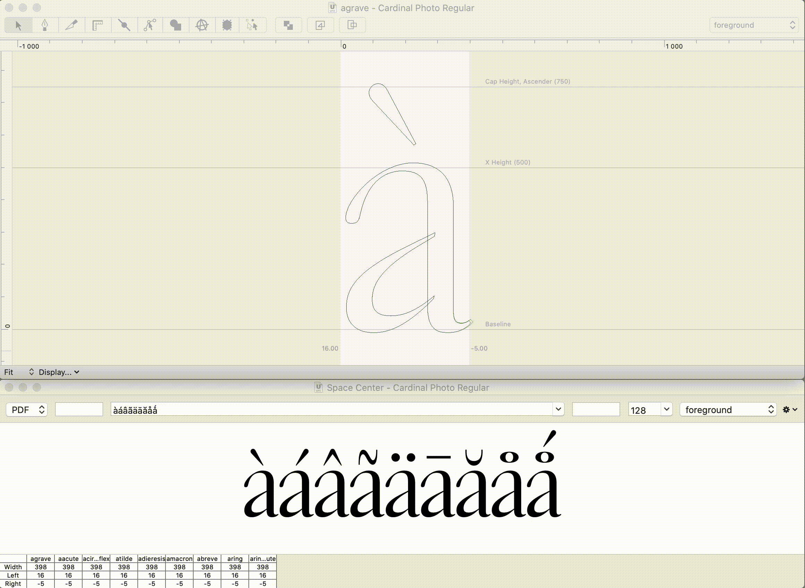
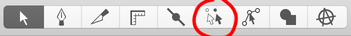
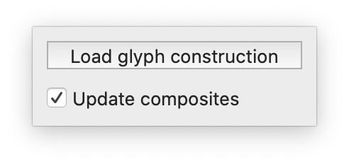

# Composite Tool

Selection tool which moves the base glyph anchor from the selected composite.

For example, if you move the `grave` component from the `agrave` glyph, it will move the corresponding anchor from `a`.

## Install
Double click on `CompositeTool.roboFontExt`

## Usage
Upon installation, a new tool will appear in your tool bar.

Select a component and move it around to the desired position, anchor on the base glyph will be updated accordingly.  
It will update other composite glyph automatically. For example, if you move the grave from the agrave, all other accented glyphs using the /a as base glyph will be updated automatically.

So far, the list of accented glyph and the way they are build are hardcoded in the extension using [glyph construction](https://doc.robofont.com/documentation/how-tos/building-accented-glyphs-with-glyph-construction/) according to Production Type standards. The standard construction file can be found in this folder. This file can be used as a example to create custom ones. It must be a `.txt`.

A small window appears when using the tool in order to set a custom glyph construction file and you can disable the automatic composite glyph builder if you have a loooot of composites. This window disappear when the tool isn’t active anymore.

Please have a look a the video located in this folder.

## Limitations
* ⚠️ You can select only **one** component.

## TO DO

* Add preferences for changing color.
* Save preferences for glyph construction file. In ufo ? In the extension ?
